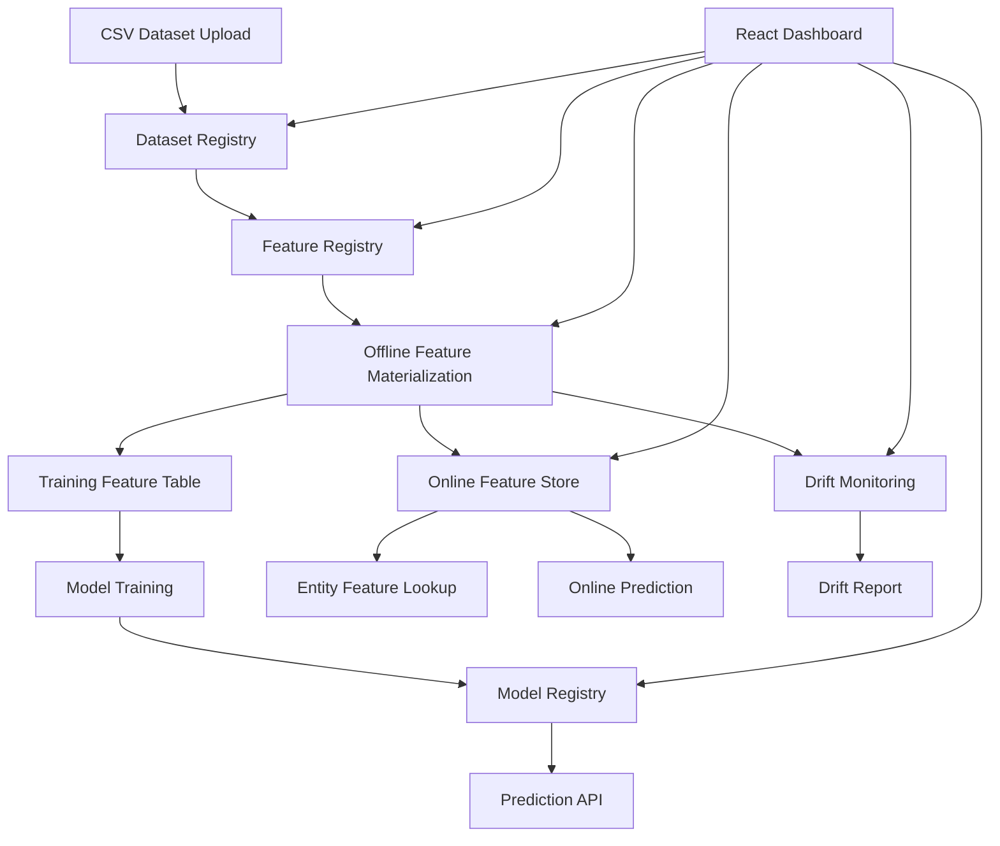

# FeatureForge

**FeatureForge** is a lightweight ML Feature Store and MLOps platform for managing datasets, reusable feature definitions, offline training tables, online feature serving, model training, prediction APIs, and feature drift monitoring.

This project is designed as an industry-style ML infrastructure system rather than a standalone notebook or single-model experiment.

---

## Overview

FeatureForge demonstrates a complete ML platform workflow:

```text
Raw Dataset
    ↓
Dataset Registry
    ↓
Feature Registry
    ↓
Offline Feature Materialization
    ↓
Model Training + Model Registry
    ↓
Prediction API
    ↓
Online Feature Store
    ↓
Drift Monitoring
```

Modern ML teams often face these problems:

- Feature logic is duplicated across notebooks, training scripts, and production services.
- Training and inference pipelines use slightly different transformations.
- Datasets, features, materializations, and models are not centrally tracked.
- Predictions are hard to trace back to the exact feature versions used during training.
- Production feature distributions drift away from training distributions.

FeatureForge solves these through a small but complete MLOps workflow.

---

## Features

### Dataset Registry

- Upload CSV datasets.
- Infer column schema automatically.
- Track dataset name, version, row count, column count, file hash, and storage path.
- Preview registered datasets through API and dashboard.

### Feature Registry

- Register reusable feature definitions.
- Supports column features, aggregate features, transformations, feature versioning, and schema validation.
- Prevents invalid features by checking source columns, entity columns, and aggregation settings.

### Offline Feature Materialization

- Converts registered feature definitions into training-ready feature tables.
- Stores materialized feature tables as CSV files.
- Tracks feature IDs, feature names, label column, rows, columns, and storage location.

### Model Training and Registry

- Trains models using materialized feature tables.
- Supports Random Forest, Logistic Regression, and XGBoost.
- Stores model artifacts using Joblib.
- Tracks feature columns, metrics, algorithm, label column, train/test split, and materialization lineage.

### Prediction API

- Loads trained model artifacts.
- Accepts JSON feature records.
- Returns predictions and class probabilities when available.
- Includes model input schema endpoint.

### Online Feature Store

- Pushes materialized feature vectors into an online serving table.
- Supports lookup by entity ID.
- Supports batch feature lookup.
- Supports prediction directly from online feature vectors.

### Drift Monitoring

- Compares reference and current materialized feature tables.
- Computes numeric drift using PSI and normalized mean shift.
- Computes categorical drift using total variation distance.
- Generates drift reports with low, medium, or high drift levels.

### React Dashboard

- Dataset upload
- Dataset registry view
- Feature creation
- Feature registry
- Offline materialization
- Model registry
- Online store operation
- Drift report generation
- Project statistics

### Dockerized Deployment

- Backend container
- Frontend container
- Docker Compose setup
- Demo seed pipeline

---

## Tech Stack

| Layer | Technology |
|---|---|
| Backend | FastAPI |
| Frontend | React, Vite |
| Database | SQLite |
| ML | scikit-learn, XGBoost |
| Data Processing | pandas, NumPy |
| Model Artifacts | Joblib |
| API Validation | Pydantic |
| Containerization | Docker, Docker Compose |
| Dashboard UI | React + CSS |
| Feature Serving | SQLite-backed online feature table |

---

## Project Structure

```text
FeatureForge/
├── backend/
│   ├── app/
│   │   ├── core/
│   │   ├── db/
│   │   ├── models/
│   │   ├── routers/
│   │   ├── schemas/
│   │   ├── services/
│   │   └── main.py
│   ├── tests/
│   ├── Dockerfile
│   └── requirements.txt
├── frontend/
│   ├── src/
│   │   ├── main.jsx
│   │   └── styles.css
│   ├── Dockerfile
│   └── package.json
├── data/
│   ├── raw/
│   └── processed/
├── artifacts/
│   ├── models/
│   └── reports/
├── scripts/
│   └── seed_demo.py
├── docs/
├── screenshots/
├── docker-compose.yml
└── README.md
```

---

## Architecture



---

## Local Run

### Backend

```bash
cd backend
python -m venv .venv
```

Windows:

```powershell
.venv\Scripts\activate
```

Install dependencies:

```bash
pip install -r requirements.txt
```

Run API:

```bash
uvicorn app.main:app --reload
```

API docs:

```text
http://127.0.0.1:8000/docs
```

### Frontend

In a second terminal:

```bash
cd frontend
npm install
npm run dev
```

Dashboard:

```text
http://localhost:5173
```

---

## Docker Run

Make sure Docker Desktop is running.

```bash
docker compose up --build
```

Dashboard:

```text
http://localhost:5173
```

API docs:

```text
http://127.0.0.1:8000/docs
```

If Docker is installed but not recognized in PowerShell, use:

```powershell
& "C:\Program Files\Docker\Docker\resources\bin\docker.exe" compose up --build
```

---

## Seed Demo Data

After the backend is running:

```bash
python scripts/seed_demo.py
```

The demo creates:

- reference transaction dataset
- current transaction dataset
- feature definitions
- offline materializations
- trained fraud model
- online feature store entries
- drift report

---

## Demo Workflow

### Upload Dataset

```text
POST /api/datasets/upload
```

### Create Feature

```text
POST /api/features
```

Example:

```json
{
  "name": "amount_log",
  "dataset_id": 1,
  "description": "Log-transformed transaction amount.",
  "entity_column": "user_id",
  "source_column": "amount",
  "feature_kind": "column",
  "transformation": "log1p",
  "output_dtype": "float"
}
```

### Materialize Features

```text
POST /api/materializations
```

### Train Model

```text
POST /api/models/train
```

Example:

```json
{
  "materialization_id": 1,
  "name": "fraud_detection_rf",
  "label_column": "is_fraud",
  "algorithm": "random_forest",
  "problem_type": "classification",
  "test_size": 0.3,
  "random_state": 42
}
```

### Push Features to Online Store

```text
POST /api/online-store/materialize
```

### Run Online Prediction

```text
POST /api/online-store/models/{model_id}/predict
```

Example:

```json
{
  "materialization_id": 1,
  "entity_column": "user_id",
  "entity_values": [1, 11, 15]
}
```

### Generate Drift Report

```text
POST /api/drift/reports
```

Example:

```json
{
  "reference_materialization_id": 1,
  "current_materialization_id": 2,
  "name": "reference_vs_current_drift",
  "feature_columns": null
}
```

---

## API Modules

| Module | Purpose |
|---|---|
| `/api/health` | API health check |
| `/api/datasets` | Dataset registry |
| `/api/features` | Feature registry |
| `/api/materializations` | Offline feature materialization |
| `/api/models` | Model training and registry |
| `/api/predictions` | Direct prediction API |
| `/api/online-store` | Online feature serving |
| `/api/drift` | Drift monitoring |

---

## Testing

Run backend tests:

```bash
cd backend
pytest
```
---

## Future Improvements

- Replace SQLite online store with Redis.
- Replace SQLite metadata database with PostgreSQL.
- Add scheduled feature materialization jobs.
- Add authentication and workspace-level access control.
- Add feature lineage graph visualization.
- Add model approval and rollback workflow.
- Add SHAP-based model explainability.
- Add CI/CD with GitHub Actions.
- Add cloud deployment on AWS/GCP/Azure.

---

## Status

FeatureForge is a working MVP demonstrating:

```text
Dataset → Feature Registry → Materialization → Model Training → Online Serving → Drift Monitoring
```
