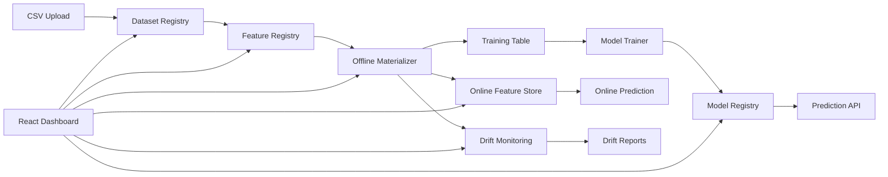

# FeatureForge Architecture

## System Goal

FeatureForge simulates the core infrastructure used in production ML systems:

- central dataset registry
- reusable feature definitions
- offline training data generation
- model training and registry
- online feature serving
- prediction APIs
- drift monitoring

---

## High-Level Architecture



---

## Backend Design

| Folder | Purpose |
|---|---|
| `models/` | SQLAlchemy database models |
| `schemas/` | Pydantic request/response schemas |
| `services/` | Business logic |
| `routers/` | FastAPI routes |
| `db/` | Database engine/session |
| `core/` | Configuration |

---

## Storage Design

| Storage | Used For |
|---|---|
| SQLite DB | metadata registry |
| `data/raw/` | uploaded datasets |
| `data/processed/` | materialized feature tables |
| `artifacts/models/` | trained model artifacts |
| Online feature table | serving entity feature vectors |

---

## Model Lifecycle

```text
Materialized Feature Table
    ↓
Feature/label split
    ↓
Train/test split
    ↓
Model training
    ↓
Metric calculation
    ↓
Joblib artifact save
    ↓
Model registry entry
```

---

## Drift Monitoring

Numeric drift:

- Population Stability Index
- normalized mean shift

Categorical drift:

- total variation distance
- new categories
- missing categories
- top-value distribution shift

Overall drift:

```text
mean(column drift scores)
```

Drift levels:

| Score | Level |
|---:|---|
| `< 0.10` | low |
| `0.10 – 0.25` | medium |
| `>= 0.25` | high |
